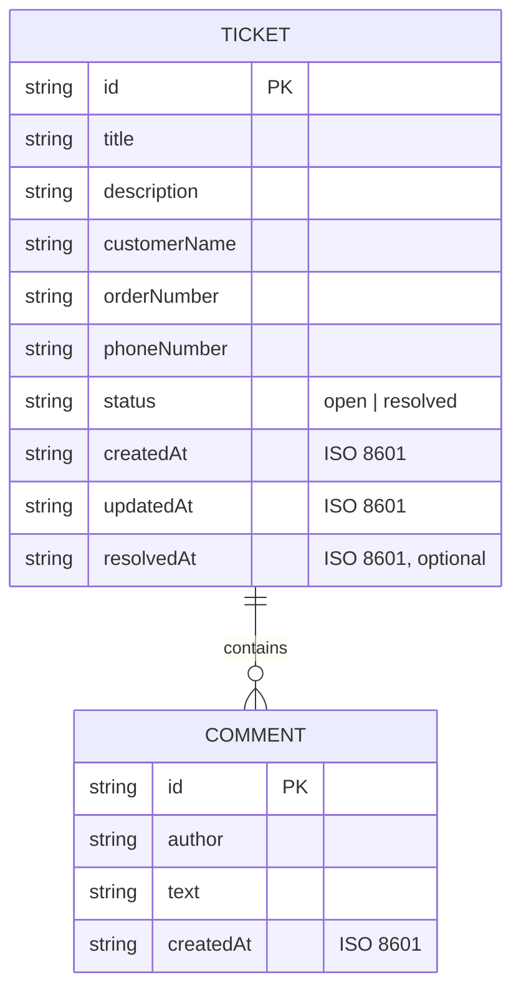

# Logical Data Model

There is no relational database; data is stored as JSON in localStorage (key `support-tickets:v1`), with each ticket embedding its comments. The diagram shows the logical relationship.

## Ticket
| Field | Notes |
|-------|-------|
| id | UUID |
| title | short, required |
| description | required |
| customerName | required |
| orderNumber | required |
| phoneNumber | required, 7–15 digits |
| status | `open` on creation, `resolved` after resolution |
| comments | array of Comment (embedded) |
| createdAt / updatedAt | ISO timestamps; `updatedAt` changes on comment or resolve |
| resolvedAt | set when resolved; absent while open |

## Comment
| Field | Notes |
|-------|-------|
| id | UUID |
| author | free text |
| text | required |
| createdAt | ISO timestamp, set automatically |

A ticket has zero or more comments; a comment belongs to exactly one ticket.
